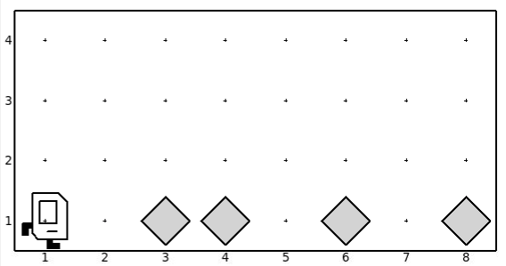
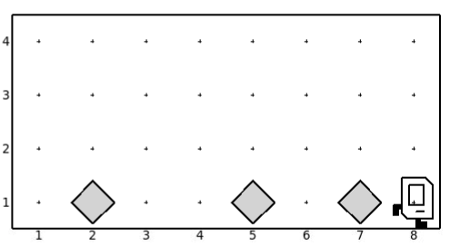

# Flip Beepers.

The task is to move karel from leftmost cell to rightmost cell, and while moving a cell has a beeper, it must be picked up, and if a cell does not have a beeper, a beeper must be placed. This problem can be used as an introduction for the concept of conditionals.

## Expected Output

