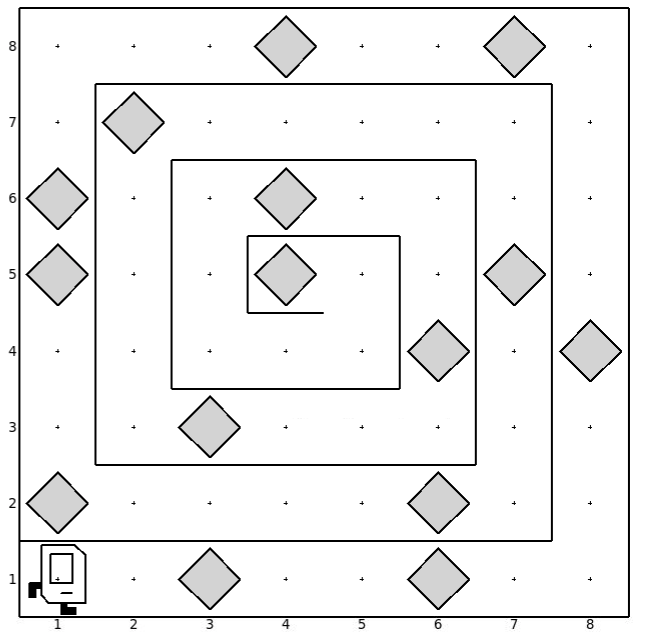

# The Spiral Maze

The task is for karel to go to the center of the spiral maze and collect all the beepers on the way there. This problem requires using conditionals along with for loops. There are several patterns that the student can recognize on order to solve this problem. First, notice that karel will always have to go left whenever it is faced with a wall. Also, the student may want to count how many steps karel has to move and use a for loop for that.

