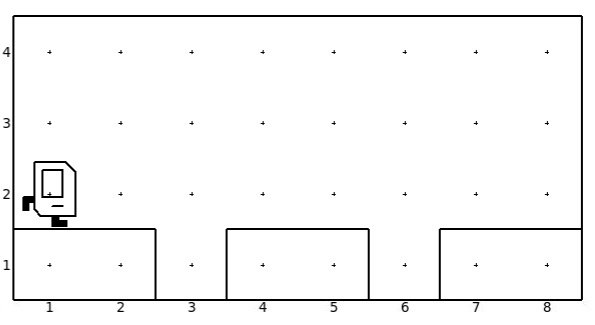

# Fix The Road

The task is to fill the empty spots of the road with Beepers, particularly at cells (3, 1) and (6, 1). The idea  is for the student to notice that there will be a repetition in the code because for each of the empty spots karel will have to move twice, go inside the spot put a beeper and then go out. Therefore they should be encouraged to create a function and use it for the repeated parts.

