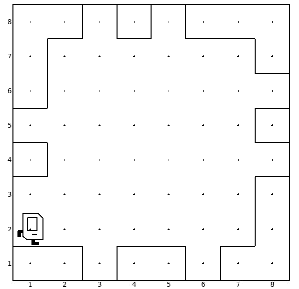

# Fix The Walls

The four walls surrounding Karel are missing some parts so Karel decided to fix them using Beepers. The task is to go around the wall side and place a beeper in every missing spot. The student is expected to spot a repeated pattern of movement for karel and encapsulate this pattern into a function call and then call it multiple times to solve the problem.

