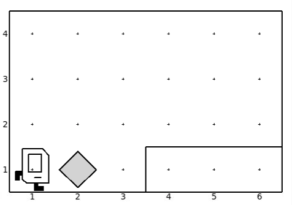

# Time to Turn Right

The task is to pick up the beeper and place it in the cell of row 2 and column 6. The goal of this problem is make the student think about the necessity of the turn right command and how to achieve it using 3 consecutive `turn_left()` commands. This can be also used as a way to introduce functions by creating the `turn_right()` function using 3 of `turn_left()`.

