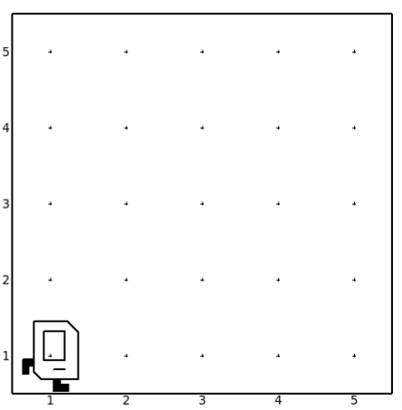

# Dancing Karel

Karel loves to the dance. Today's mood? Let's do the twist. Write a program that makes Karel walk across the dance floor (hmm, aka streets) but she must do a full turn at each step. So Karel does a spin in each round,which is turn left once and keep going until her feet are on the ground again.

